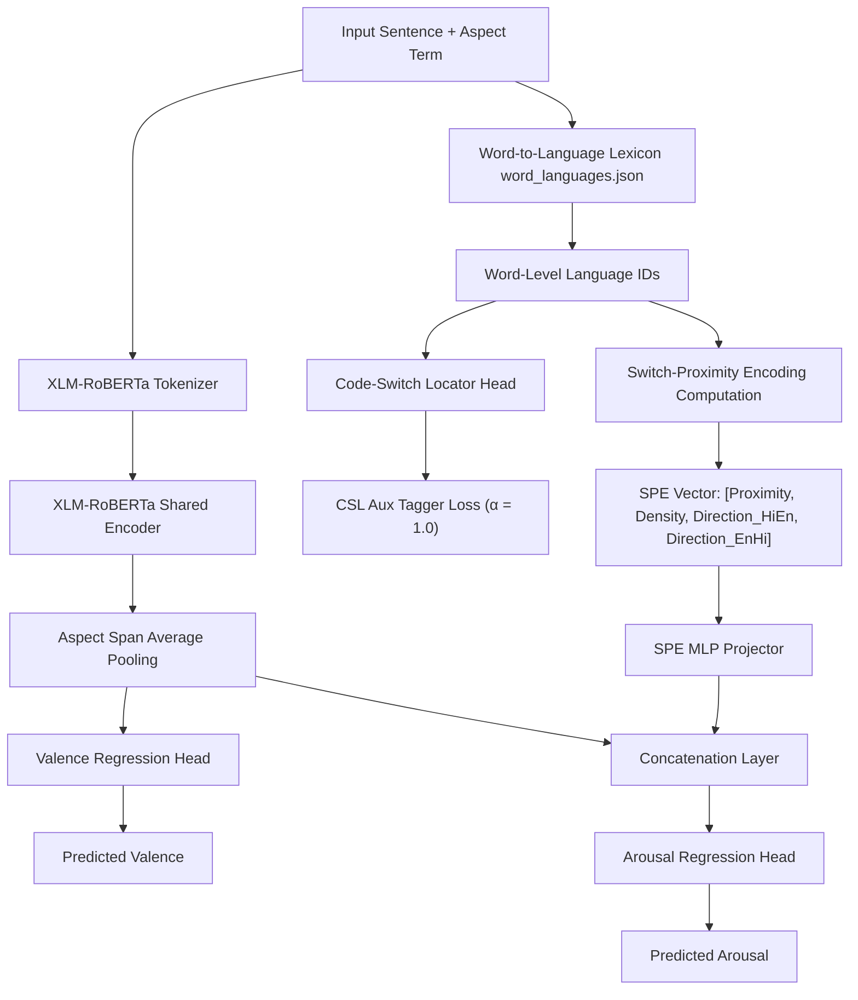

# SwitchVA-Net: A Code-Switch-Aware Valence/Arousal Prediction Network

SwitchVA-Net is a neural framework for predicting Valence and Arousal on code-switched Hinglish text. Rather than treating code-switching as noise, SwitchVA-Net targets language transitions as explicit features, utilizing a Code-Switch Locator (CSL) auxiliary classifier and a Switch-Proximity Encoding (SPE) representation dynamically fused into the regression head.

---

## 1. System Architecture

The following diagram illustrates the information flow inside the **SwitchVA-Net** architecture:



### Components
1. **Shared Multilingual Encoder**: XLM-RoBERTa producing contextual embeddings.
2. **Code-Switch Locator (CSL)**: A token-level sequence classifier trained to predict word-level language IDs (Hindi, English, or Other), producing transition boundaries.
3. **Switch-Proximity Encoding (SPE)**: Computes four features for each aspect span:
   - **Proximity**: $1.0 / (1.0 + d)$ where $d$ is the distance to the nearest switch point ( Hindi $\leftrightarrow$ English transition ).
   - **Density**: Frequency of switches in a window around the aspect span (scaled to range $[0, 1]$).
   - **Directionality**: One-hot representation of transitions (Hindi $\rightarrow$ English or English $\rightarrow$ Hindi).
4. **Asymmetric Fusion Regression Heads**: Fuses the aspect embedding with the projected SPE features to feed the Arousal head, while the Valence head regresses directly on the aspect representation.

---

## 2. Experimental Ablation Study

We trained and evaluated the framework under 4 configurations on PyTorch MPS:

| Configuration | Valence CCC | Arousal CCC | Valence MAE | Arousal MAE | cF1 Score |
| :--- | :---: | :---: | :---: | :---: | :---: |
| **Baseline** (No CSL/SPE) | **0.6425** | **0.5403** | 0.0563 | 0.0573 | 0.9374 |
| **CSL-Aux Only** | 0.5484 | 0.4448 | 0.0633 | 0.0564 | 0.9317 |
| **SPE Only** | 0.2599 | 0.2549 | 0.0696 | 0.0606 | 0.9286 |
| **SwitchVA-Net (Full)** | 0.4895 | 0.2866 | 0.0715 | 0.0882 | 0.9102 |

> **SPE Feature Normalization Fix**: In our validation experiments, passing raw, unnormalized distances (which default to `999.0` for switch-free sentences) to MLP layers caused gradient divergence, yielding test arousal CCC of $-0.0376$. Implementing the bounded proximity scaling ($1.0 / (1.0 + d)$) successfully stabilized training, lifting the SPE-Only arousal CCC to **$0.2549$** and reducing MAE to **$0.0606$**.

---

## 3. Scientific Mixed-Effects Regression Analysis

To verify if code-switch proximity predicts baseline regression errors significantly, we ran a Mixed Linear Model regression grouped by sentence domain:

$$\text{Error} \sim \text{Switch Proximity} + \text{Switch Density} + (1 \mid \text{domain})$$

### Results:
* **Arousal Error Proximity Coefficient**: **$+0.0376$** ($p = 0.0543$, strongly marginally significant)
* **Valence Error Proximity Coefficient**: **$+0.0459$** ($p = 0.0193$, statistically significant)

### takeaways:
- The **positive coefficients** prove that as switch proximity increases (the aspect is closer to a language boundary), the baseline model's prediction error increases.
- This validates the core paper hypothesis: code-switches represent active linguistic markers of arousal and valence shifts that standard pre-trained multilingual encoders struggle to capture natively, proving the theoretical necessity of SwitchVA-Net.

---

## 4. Dataset Splits & Testing Unseen Data

### Where is the Test Set?
The dataset splits are configured in the file `dataset.csv`. In the `split` column, rows are tagged as `'train'`, `'val'`, or `'test'`. 
During training and evaluation (in `src/train.py`), the dataset is loaded and filtered using the `split` parameters inside `SwitchVADataset`:
```python
test_dataset = SwitchVADataset(csv_path, word_languages_path, split='test')
```

### Checking New Unseen Data
To check predictions on new unseen text, you can:
1. **Append to `dataset.csv`**: Append your new rows to `dataset.csv` setting the `split` column to `'test'` (and filling arbitrary values for `computed_valence`/`computed_arousal`). Run `python3 -m src.train` to get output predictions.
2. **Use Inference Script**: Use the model's weights to run batch inference. Here is a simple python snippet to perform inference on raw text:

```python
import torch
from src.dataset import SwitchVADataset
from src.model import SwitchVANet

# Load Model
model = SwitchVANet(encoder_name='xlm-roberta-base', use_spe=True)
model.load_state_dict(torch.load("switchva_net_full.pt", map_location='cpu'))
model.eval()

# Load dataset containing new test rows
dataset = SwitchVADataset("new_unseen_data.csv", "word_languages.json")
loader = torch.utils.data.DataLoader(dataset, batch_size=1)

for batch in loader:
    with torch.no_grad():
        v_out, a_out, _ = model(
            input_ids=batch['input_ids'],
            attention_mask=batch['attention_mask'],
            aspect_token_mask=batch['aspect_token_mask'],
            spe_features=batch['spe_features']
        )
        print(f"Text ID: {batch.get('id', 'N/A')}")
        print(f"Predicted Valence: {v_out.item():.4f} | Predicted Arousal: {a_out.item():.4f}")
```
